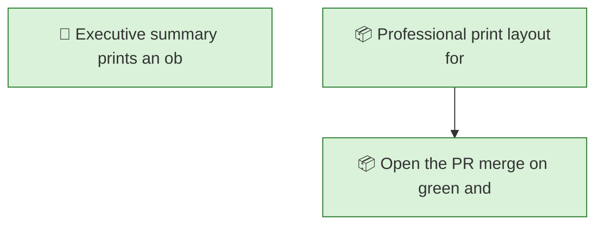
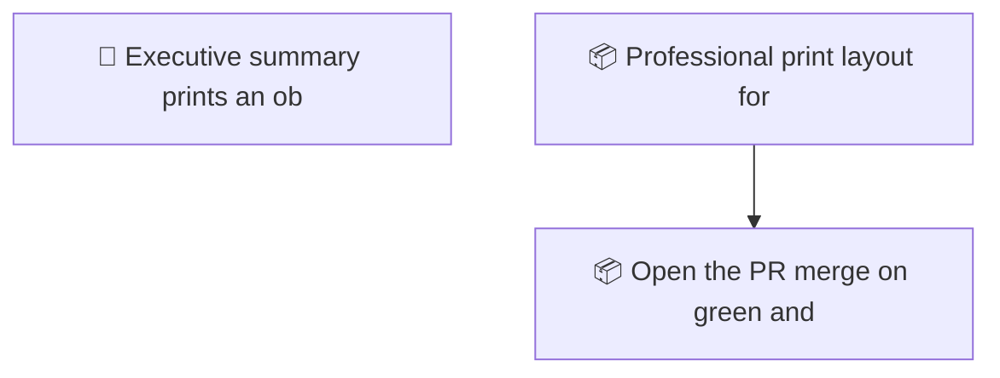

<!-- GENERATED by worklog roadmap-render. DO NOT EDIT. -->

> This file is generated from `.work/todo.jsonl`. Edits will be overwritten.
> To change the roadmap, change the work items: `worklog add|update|close`.

# Roadmap

_1 epic(s) in flight, 2 open item(s), 0 blocked, 0 unclassified._

## Now

### Professional print layout for PDF and Word export  ·  P1  ·  7 of 8 done  ·  feature 7 / bug 1
The PDF and Word exports have no page numbers, no footer, and no page margins after page 1. Sections start in the middle of a page, and diagrams move away from their headings and tables. This work gives both exports a professional page layout and title-cases a lowercase product name.

| # | Item | Type | Priority | Status | Blocked by |
|---|---|---|---|---|---|
| [234](https://github.com/SpillwaveSolutions/prd-forge-viewer/issues/234) | Open the PR, merge on green, and cut release 0.5.0 | task | P1 | in progress | — |

### (no epic)

| # | Item | Type | Priority | Status | Blocked by |
|---|---|---|---|---|---|
| [227](https://github.com/SpillwaveSolutions/prd-forge-viewer/issues/227) | Executive summary prints an objective id instead of its sentence | task | P1 | in progress | — |

## Next

_Nothing here._

## Later

_Nothing here._

## Visual roadmap

### Dependency graph

```mermaid
graph TD
    01M6HNNFB76PGJKVMB2YYJ95N9["🐛 Executive summary prints an ob"]
    01M7JYNEDBP6V12CES431GFAF6["📦 Professional print layout for"]
    01M7JYNEECM7V957HNK5G96QV7["📦 Open the PR merge on green and"]
    01M7JYNEDBP6V12CES431GFAF6 --> 01M7JYNEECM7V957HNK5G96QV7
    classDef in_progress fill:#d9f2d9,stroke:#2e7d32
    class 01M6HNNFB76PGJKVMB2YYJ95N9,01M7JYNEDBP6V12CES431GFAF6,01M7JYNEECM7V957HNK5G96QV7 in_progress
```

### Hierarchy

```mermaid
graph TD
    01M6HNNFB76PGJKVMB2YYJ95N9["🐛 Executive summary prints an ob"]
    01M7JYNEDBP6V12CES431GFAF6["📦 Professional print layout for"]
    01M7JYNEECM7V957HNK5G96QV7["📦 Open the PR merge on green and"]
    01M7JYNEDBP6V12CES431GFAF6 --> 01M7JYNEECM7V957HNK5G96QV7
```
